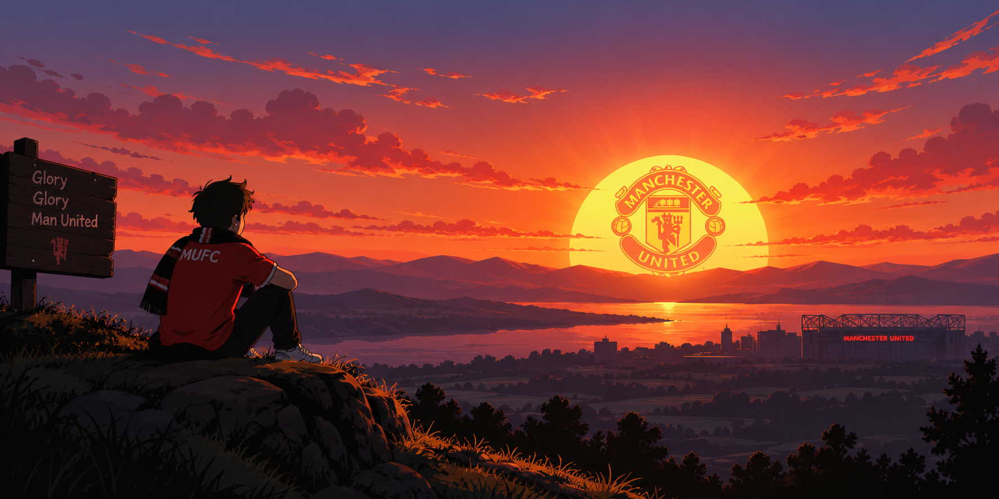

  

I'm **Quoc Duy**, a **Full-Stack Developer** and final-year Software Engineering student at **Da Nang University of Science and Technology (DUT)**. I enjoy building clean, efficient applications and exploring better ways to design scalable software.

## 🚀 About Me

* 🎓 Final-year Software Engineering student at **[Da Nang University of Science and Technology ](https://dut.udn.vn/)**
* 💻 Interested in **Full-Stack Web & Mobile Development**
* 🎯 Focusing on **System Design, Performance Optimization, SEO & Clean Code**
* 🌐 Portfolio Website: **[duyaivy.id.vn](https://www.duyaivy.id.vn/)**
* 💼 LinkedIn: **[Quốc Duy](https://linkedin.com/in/qu%E1%BB%91c-duy-78444b346)**
* 📫 Email: **[quocduy0322@gmail.com](mailto:quocduy0322@gmail.com)**

## 🛠️ Main Tech Stack

  

<picture>
  <source
    media="(prefers-color-scheme: dark)"
    srcset="https://raw.githubusercontent.com/duyaivy/duyaivy/output/github-snake-dark.svg"
  />

  <source
    media="(prefers-color-scheme: light)"
    srcset="https://raw.githubusercontent.com/duyaivy/duyaivy/output/github-snake.svg"
  />

  
</picture>

  

